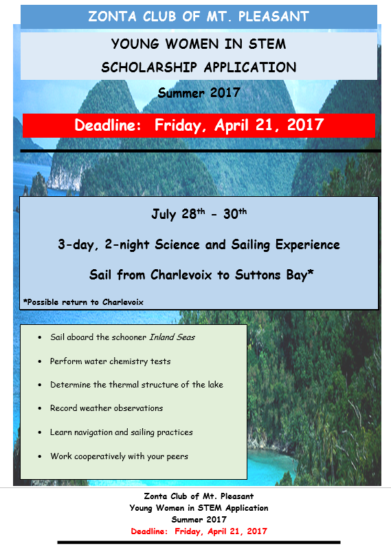

## Applications being taken for Young Women in STEM Experience {#applications-being-taken-for-young-women-in-stem-experience}

The Zonta Club of Mt. Pleasant invites young women in grades 9 through 12, to apply for the Young Women in STEM (Science, Technology, Engineering and Mathematics) opportunity taking place this summer. Please consider applying to participate in a science and sailing experience aboard the schooner Island Seas.

Please see flyer for more information. Applications are available in the Guidance of High School Office.

***